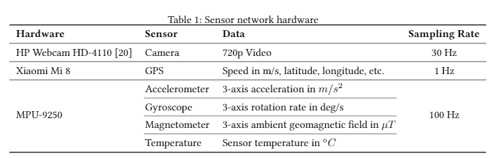
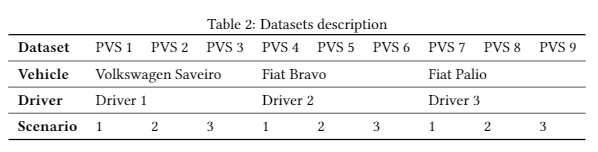

    

 

# Intelligent Vehicle Perception Based on Inertial Sensing and Artificial Intelligence

This project aims to develop models for vehicular perception through inertial sensor signals. Vehicular perception comprises environment perception and proprioception. Environment perceptions aims to understand the environment outside the vehicle, recognizing the path features on which it travels. These features include transient events in the form of anomalies and obstacles, such as potholes, cracks, speed bumps, etc.; and persistent events, such as surface type, conservation condition and the road surface quality. On the other hand, proprioception aims to understand vehicular movements to identify their own behavior. These identifications can also be transient in the form of driving events, such as lane change, braking, skidding, aquaplaning, turning right or left; and persistent, as a safe or dangerous driving behavior profile.

For the development of this project, we collect nine datasets with contextual variations using GPS, camera and inertial sensors, represented by accelerometers and gyroscopes. These data were produced in three different vehicles, with three different drivers, in three different environments. Below are described the perception models already developed and respective paper, the libraries used and the datasets produced.

## Vehicular Perception Research

The project is currently active and we are developing new models. Below are results obtained with models already produced:

- [Road Surface Type Classification Based on Inertial Sensors and Machine Learning](https://github.com/Intelligent-Vehicle-Perception/Road-Surface-Type-Classification-Based-on-Inertial-Sensors-and-Machine-Learning): in this research, we developed models for the road surface classification, classifying between segments of dirt, cobblestone and alphalt roads. We applied classical techniques of K-Means Clustering (KMC), Support Vector Machine (SVM) and K-Nearest Neighbors (KNN); and Deep Learning techniques based on Convolutional Neural Network (CNN), Long Short-Term Memory Network (LSTM) and hybrid LSTM-CNN.

## PVS - Passive Vehicular Sensors Dataset

To collect and preprocess the raw data that resulted in the PVS datasets, the following projects were used:

- [MPU-9250 Sensors Data Collect](https://github.com/Intelligent-Vehicle-Perception/MPU-9250-Sensors-Data-Collect): source-code used to manipulate the sensors in the data collection.

- [MPU-9250 and GPS Raw Data Pre-Processing](https://github.com/Intelligent-Vehicle-Perception/MPU-9250-and-GPS-Raw-Data-Pre-Processing): source-codes of adjustments in the data of inertial sensors, combinating with GPS data and labeling.

- [MPU-9250 Data Plot Video Creator](https://github.com/Intelligent-Vehicle-Perception/MPU-9250-Data-Plot-Video-Creator/): source-codes for creating videos with graphics of speed and signals from inertial sensors.

For data collection, we use several passive approach sensors, detailed in the following table:

    

All the hardware equipment was attached to the vehicle as shown in next figure. The camera was placed on the outside car roof (1), and the GPS receiver was placed internally on the dashboard (2). Two networks with MPU-9250 modules were distributed in the vehicle in order to get data coming from different points. Thus, each end of the front axle (right and left side) received one of the sensor networks, where a module was attached to the control arm (4), located below and close to the vehicle suspension; another module was placed above and close to the suspension, attached to the bodywork immediately above the tire (3); and another module was attached to the vehicle dashboard (2), inside the cabin.

    

The data were produced in three different vehicles, with three different drivers, in three different environments in which there are three different surface types, in addition to variations in conservation state and presence of obstacles and anomalies, such as speed bumps and potholes. The following figure details the data collection contexts.

    

| DataSet | Description                                                                                                     |
|---------|-----------------------------------------------------------------------------------------------------------------|
| PVS 1   | Data sampled in the Volkswagen Saveiro vehicle, traveling through Scenario 1 with Driver 1, on a 13.81 km route |
| PVS 2   | Data sampled in the Volkswagen Saveiro vehicle, traveling through Scenario 2 with Driver 1, on a 11.62 km route |
| PVS 3   | Data sampled in the Volkswagen Saveiro vehicle, traveling through Scenario 3 with Driver 1, on a 10.72 km route |
| PVS 4   | Data sampled in the Fiat Bravo vehicle, traveling through Scenario 1 with Driver 2, on a 13.81 km route         |
| PVS 5   | Data sampled in the Fiat Bravo vehicle, traveling through Scenario 2 with Driver 2, on a 11.63 km route         |
| PVS 6   | Data sampled in the Fiat Bravo vehicle, traveling through Scenario 3 with Driver 2, on a 10.73 km route         |
| PVS 7   | Data sampled in the Fiat Palio vehicle, traveling through Scenario 1 with Driver 3, on a 13.78 km route         |
| PVS 8   | Data sampled in the Fiat Palio vehicle, traveling through Scenario 2 with Driver 3, on a 11.63 km route         |
| PVS 9   | Data sampled in the Fiat Palio vehicle, traveling through Scenario 3 with Driver 3, on a 10.74 km route         |

The nine datasets are available for download at this link [PVS Datasets](https://arquivos.ufsc.br/d/55ee83c2c9d647eaa252/?p=/&mode=grid). Each dataset consists of the following files:

| File                       | Description                                                                                                           |
|----------------------------|-----------------------------------------------------------------------------------------------------------------------|
| dataset_gps.csv            | GPS dataset, including latitude, longitude, altitude, speed, accuracy, etc                                            |
| dataset_gps_mpu_left.csv   | Inertial sensor dataset on the left side of the vehicle, along with GPS data                                          |
| dataset_gps_mpu_right.csv  | Inertial sensor dataset on the right side of the vehicle, along with GPS data                                         |
| dataset_labels.csv         | Data labels for each sample data in the dataset. Currently has road surface type labels                               |
| dataset_mpu_left.csv       | Inertial sensor dataset on the left side of the vehicle                                                               |
| dataset_mpu_right.csv      | Inertial sensor dataset on the right side of the vehicle                                                              |
| dataset_settings_left.csv  | Settings of the inertial sensors placed on the left side of the vehicle. Includes measurement range, resolution, etc  |
| dataset_settings_right.csv | Settings of the inertial sensors placed on the right side of the vehicle. Includes measurement range, resolution, etc |
| map.html                   | Map of the data collection location                                                                                   |
| video_dataset_left.mp4     | Video with the graphics of the signals of the inertial sensors                                                        |
| video_environment.mp4      | Video ambient                                                                                                         |

Below, an example of an ambient video side by side with the video of graphics of the signals from the sensors.

    

