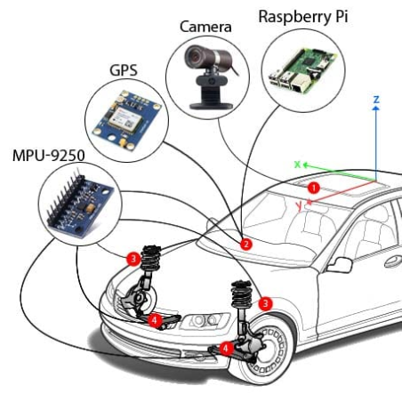
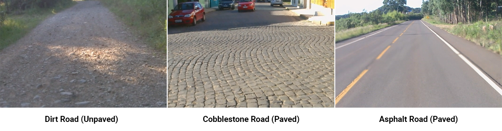
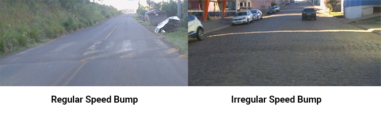

<div align="center">
    <a href="https://github.com/Intelligent-Vehicle-Perception/Intelligent-Vehicle-Perception-Based-on-Inertial-Sensing-and-Artificial-Intelligence">
        
    </a>
</div>

<div align="center">

[](https://github.com/Intelligent-Vehicle-Perception/Intelligent-Vehicle-Perception-Based-on-Inertial-Sensing-and-Artificial-Intelligence)
[](https://github.com/Intelligent-Vehicle-Perception/Intelligent-Vehicle-Perception-Based-on-Inertial-Sensing-and-Artificial-Intelligence)
[](LICENSE) 

[](https://github.com/Intelligent-Vehicle-Perception/Intelligent-Vehicle-Perception-Based-on-Inertial-Sensing-and-Artificial-Intelligence/issues)
[](https://github.com/Intelligent-Vehicle-Perception/Intelligent-Vehicle-Perception-Based-on-Inertial-Sensing-and-Artificial-Intelligence/network/members)
[](https://github.com/Intelligent-Vehicle-Perception/Intelligent-Vehicle-Perception-Based-on-Inertial-Sensing-and-Artificial-Intelligence/stargazers)
[](https://github.com/Intelligent-Vehicle-Perception/Intelligent-Vehicle-Perception-Based-on-Inertial-Sensing-and-Artificial-Intelligence/watchers)
[](https://github.com/Intelligent-Vehicle-Perception/Intelligent-Vehicle-Perception-Based-on-Inertial-Sensing-and-Artificial-Intelligence/graphs/contributors/)
[](https://github.com/Intelligent-Vehicle-Perception/Intelligent-Vehicle-Perception-Based-on-Inertial-Sensing-and-Artificial-Intelligence)

</div>

# Intelligent Vehicle Perception Based on Inertial Sensing and Artificial Intelligence

This project aims to develop models for vehicular perception through inertial sensor signals and Artificial Intelligence. Vehicular perception comprises exteroception and proprioception. Exteroception aims to understand the environment outside the vehicle, recognizing the path features on which it travels. These features include transient events in the form of anomalies and obstacles, such as potholes, cracks, speed bumps, etc.; and persistent events, such as surface type, conservation condition and the road surface quality. On the other hand, proprioception aims to understand vehicular movements to identify their own behavior. These identifications can also be transient in the form of driving events, such as lane change, braking, skidding, aquaplaning, turning right or left; and persistent, as a safe or dangerous driving behavior profile.

For the development of this project, we collect nine datasets with contextual variations using GPS, camera and inertial sensors, represented by accelerometers and gyroscopes. These data were produced in three different vehicles, driven by three different drivers, traveling through three different environments. To recognize and classify the vehicular perception patterns, we have developed several models based on Artificial Intelligence. Below we describe the datasets produced, models developed and the results obtained, together with published article and source-codes.

## Table of Contents
- [Vehicular Perception Research](#Vehicular-Perception-Research)
- [Passive Vehicular Sensors Dataset](#Passive-Vehicular-Sensors-Dataset)
- [Data Class Labels](#Data-Class-Labels)
- [Aplications](#Aplications)
- [How To Cite](#How-To-Cite)
- [License](#License)

## Vehicular Perception Research

The project is active and we are currently developing new models for new perception patterns recognition. Below are described the research progress. Published articles can also be found on the project's page at [Research Gate](https://www.researchgate.net/project/Intelligent-Vehicle-Perception-Based-on-Inertial-Sensing-and-Artificial-Intelligence).

- [Vehicular Perception Based on Inertial Sensing: a Systematic Review](Vehicular-Perception-Based-on-Inertial-Sensing-A-Systematic-Review.md)
    - In this article, we describe the state-of-the-art of vehicle perception produced through inertial sensors and Artificial Intelligence techniques. Through a literature review we compiled the data extracted from the selected studies and described each paper in detail and in chronological order of publication. 

- [Vehicular Perception Based on Inertial Sensing: A Structured Mapping of Approaches and Methods](Vehicular-Perception-Based-on-Inertial-Sensing-A-Structured-Mapping-of-Approaches-and-Methods.md)
    - In this article, we present a structured literature mapping of the state-of-the-art of vehicle perception produced through inertial sensors and Artificial Intelligence techniques. We present a structured, approach and technologies-oriented panorama of this field.

- [Road Surface Type Classification Based on Inertial Sensors and Machine Learning: A Comparison Between Classical and Deep Machine Learning Approaches For Multi-Contextual Real-world Scenarios](https://github.com/Intelligent-Vehicle-Perception/Road-Surface-Type-Classification-1)
    - In this research, we developed models for the road surface type classification, classifying between segments of dirt, cobblestone and alphalt roads. We applied classical techniques of K-Means Clustering (KMC), Support Vector Machine (SVM) and K-Nearest Neighbors (KNN); and Deep Learning techniques based on Convolutional Neural Network (CNN), Long Short-Term Memory Network (LSTM) and hybrid LSTM-CNN. We analyzed in the time domain the data collected near and below the suspension in contextual variations, in addition to the impact of the data window.

- [Multi-Contextual and Multi-Aspect Analysis for Road Surface Type Classification Through Inertial Sensors and Deep Learning](https://github.com/Intelligent-Vehicle-Perception/Road-Surface-Type-Classification-2)
    - In this research, we developed models for the road surface type classification, classifying between segments of dirt, cobblestone and alphalt roads. We applied Deep Learning techniques based on Convolutional Neural Network (CNN), Gated Recurrent Unit (GRU) and Long Short-Term Memory Network (LSTM). We analyzed various aspects, such as the influence of the vehicle data collection point, the analysis domain, the model input features, and the data window.

## Passive Vehicular Sensors Dataset (PVS)

The nine datasets collected are available for download at this link [PVS Datasets Download in Arquivos UFSC](https://arquivos.ufsc.br/d/55ee83c2c9d647eaa252/?p=/&mode=grid) and at this link [PVS Datasets Download in Kaggle](https://www.kaggle.com/jefmenegazzo/datasets). To collect and preprocess the raw data that resulted in the PVS datasets, the following projects were used:

- [MPU-9250 Sensors Data Collect](https://github.com/Intelligent-Vehicle-Perception/MPU-9250-Sensors-Data-Collect)
    - Source-code used to manipulate the sensors in the data collection.

- [MPU-9250 and GPS Raw Data Pre-Processing](https://github.com/Intelligent-Vehicle-Perception/MPU-9250-and-GPS-Raw-Data-Pre-Processing)
    - Source-code used for initial adjustments to inertial sensor raw data, such as combining with GPS data and creating data class labels.

- [MPU-9250 Data Plot Video Creator](https://github.com/Intelligent-Vehicle-Perception/MPU-9250-Data-Plot-Video-Creator/)
    - Source-code for create videos with data plot of speed and signals from inertial sensors.

For data collection, we use several passive approach sensors, detailed in the following table:

|      Hardware     |     Sensor    |                   Data                  | Sampling Rate |
|:-----------------:|:-------------:|:---------------------------------------:|:-------------:|
| HP Webcam HD-4110 | Camera        | 720p Video                              |     30 Hz     |
| Xiaomi Mi 8       | GPS           | Speed in m/s, latitude, longitude, etc. |      1 Hz     |
| MPU-9250          | Accelerometer | 3-axis acceleration in m/s²             |     100 Hz    |
| MPU-9250          | Gyroscope     | 3-axis rotation rate in deg/s           |     100 Hz    |
| MPU-9250          | Magnetometer  | 3-axis ambient geomagnetic field in µT  |     100 Hz    |
| MPU-9250          | Temperature   | Sensor temperature in ◦C                |     100 Hz    |

All the hardware equipment was attached to the vehicle as shown in next figure. The camera was placed on the outside car roof (1), and the GPS receiver was placed internally on the dashboard (2). Two networks with MPU-9250 modules were distributed in the vehicle in order to get data coming from different points. Thus, each end of the front axle (right and left side) received one of the sensor networks, where a module was attached to the control arm (4), located below and close to the vehicle suspension; another module was placed above and close to the suspension, attached to the bodywork immediately above the tire (3); and another module was attached to the vehicle dashboard (2), inside the cabin.

<div align="center">
    
</div>

The data were produced in three different vehicles, with three different drivers, in three different environments in which there are three different surface types, in addition to variations in conservation state and presence of obstacles and anomalies, such as speed bumps and potholes. The following table details the data collection contexts.

| DataSet |       Vehicle      |  Driver  |  Scenario  | Distance |
|:-------:|:------------------:|:--------:|:----------:|:--------:|
| PVS 1   | Volkswagen Saveiro | Driver 1 | Scenario 1 | 13.81 km |
| PVS 2   | Volkswagen Saveiro | Driver 1 | Scenario 2 | 11.62 km |
| PVS 3   | Volkswagen Saveiro | Driver 1 | Scenario 3 | 10.72 km |
| PVS 4   | Fiat Bravo         | Driver 2 | Scenario 1 | 13.81 km |
| PVS 5   | Fiat Bravo         | Driver 2 | Scenario 2 | 11.63 km |
| PVS 6   | Fiat Bravo         | Driver 2 | Scenario 3 | 10.73 km |
| PVS 7   | Fiat Palio         | Driver 3 | Scenario 1 | 13.78 km |
| PVS 8   | Fiat Palio         | Driver 3 | Scenario 2 | 11.63 km |
| PVS 9   | Fiat Palio         | Driver 3 | Scenario 3 | 10.74 km |

Each dataset consists of the following files:

| File                       | Description                                                                                                            |
|----------------------------|------------------------------------------------------------------------------------------------------------------------|
| dataset_gps.csv            | GPS data, including latitude, longitude, altitude, speed, accuracy, etc.                                               |
| dataset_gps_mpu_left.csv   | Inertial sensor data on the left side of the vehicle, combined with GPS data.                                          |
| dataset_gps_mpu_right.csv  | Inertial sensor data on the right side of the vehicle, combined with GPS data.                                         |
| dataset_labels.csv         | Data class labels for each sample data in the dataset (for both sides).                                                |
| dataset_mpu_left.csv       | Inertial sensor data on the left side of the vehicle.                                                                  |
| dataset_mpu_right.csv      | Inertial sensor data on the right side of the vehicle.                                                                 |
| dataset_settings_left.csv  | Settings of the inertial sensors placed on the left side of the vehicle. Includes measurement range, resolution, etc.  |
| dataset_settings_right.csv | Settings of the inertial sensors placed on the right side of the vehicle. Includes measurement range, resolution, etc. |
| map.html                   | Map of the data collection location.                                                                                   |
| video_dataset_left.mp4     | Video with data plotted from inertial sensors and speed, sampled on the left side of the vehicle.                      |
| video_dataset_right.mp4    | Video with data plotted from inertial sensors and speed, sampled on the right side of the vehicle.                     |
| video_environment.mp4      | External environment video.                                                                                            |
| video_environment_dataset_left.mp4      | Videos side by side from video_environment.mp4 and video_dataset_left.mp4                                 |
| video_environment_dataset_right.mp4     | Videos side by side from video_environment.mp4 and video_dataset_ight.mp4                                 |

Below, the playlist of videos side by side on youtube (click on the image or [here](https://www.youtube.com/playlist?list=PLTG6ZC9RiP1dxQk5Wf6UiNxwRyGv-keY7)).

[](https://www.youtube.com/playlist?list=PLTG6ZC9RiP1dxQk5Wf6UiNxwRyGv-keY7 "Play PVS Playlist")

## Data Class Labels

The data classes available in the **dataset_labels.csv** file were built in one-hot-encoded form. We are currently developing new data class labels. The following are already available:

- **Road Surface Type Labels**

|    Description   |    Label    |
|:----------------:|:-----------:|
| Dirt Road        | dirt_road        |
| Cobblestone Road | cobblestone_road |
| Asphalt Road     | asphalt_road     |

<br>

|    Description   |    Label    |
|:----------------:|:-----------:|
| Paved Road       | paved_road   |
| Unpaved Road     | unpaved_road |


<br>

<div align="center">
    
</div>

- **Speed Bump**

|    Description   |    Label    |
|:----------------:|:-----------:|
| No Speed Bump        | no_speed_bump        |
| Regular Speed Bump   | regular_speed_bump   |
| Irregular Speed Bump | irregular_speed_bump |

<br>

<div align="center">
    
</div>

## Aplications

The recognized and classified patterns of vehicular perception have wide applicability. Below are some applications that can use this information:

- Autonomous Vehicles
- Advanced Vehicle Control Systems
- Advanced Driver Assistance Systems
- Advanced Public Transport Management Systems
- Advanced Traffic Management Systems
- Advanced Traveler Information Systems
- Vehicle Black Box
- Evaluation Software for Control and Quality Assurance in Civil Engineering
- Mobile Crowdsensing Applications

## How To Cite

To cite PVS Datasets, use the reference below:

```bibtex
@misc{PVSDataset2020,
  author = {Menegazzo, J. and von Wangenheim, A.},
  title = {Passive Vehicular Sensors Datasets - PVS},
  year = {2020},
  publisher = {LAPIX/INCoD/UFSC},
  journal = {INCoD Datasets Repository},
  howpublished = {\url{https://codigos.ufsc.br/lapix/intelligent-vehicle-perception-based-on-inertial-sensing}}
}
```

## License

The MIT License (MIT). Please see [License File](LICENSE) for more information.